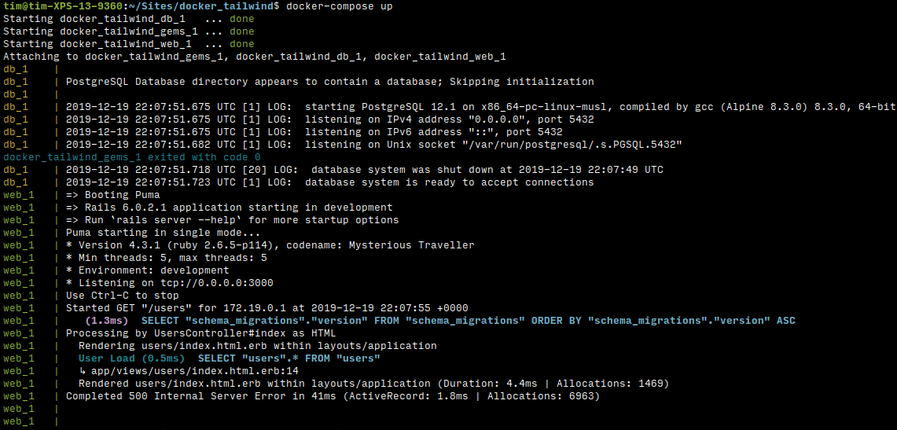

# Setup my docker containers for Rails development

Follow these steps, one-by-one, until you get to the Appendix.

## 1. Initial setup

### a. Starting a new project from scratch

Create a new folder to work in:

```
mkdir my_new_folder
cd my_new_folder
```

```bash
# Add the `Dockerfile`, `docker-compose.yml`, and `Gemfile` files:
curl -s 'https://raw.githubusercontent.com/turgs/dockerness/master/local_rails/Dockerfile' > Dockerfile
curl -s 'https://raw.githubusercontent.com/turgs/dockerness/master/local_rails/docker-compose.yml' > docker-compose.yml
echo $'source "https://rubygems.org"\ngem "rails"' > Gemfile

# Create the containers, then run bundle install and rails new:
docker-compose run --rm web bundle install
docker-compose run --rm web bundle exec rails new . -d postgresql --force --skip-keeps --skip-action-mailer --skip-action-cable --skip-test --skip-git
mkdir -p app/assets/images

# Change owner of generated files back to me:
sudo chown -R $USER:$USER .
```

Ensure app can talk to be DB. Edit `config/database.yml`:

```yml
default: &default
  ...
  host: db
  port: 5432
  username: postgres
```

Setup the DB:

```shell
docker-compose run --rm web bin/rails db:create
docker-compose run --rm web bin/rails db:migrate
```

### b. Existing project

Ensure app can talk to be DB. Edit `config/database.yml`:

```yml
default: &default
  ...
  host: db
  port: 5432
  username: postgres
```

## 2. All projects

#### Enable Gems and DB

Load gems and setup database:

```shell
docker-compose run --rm web bundle
docker-compose run --rm web bin/rails db:setup
sudo chown -R $USER:$USER .
```

#### Enable views to render from console.

Add this to `config/environments/development.rb`:

```ruby
config.web_console.permissions = begin
  addrinfo = Socket.ip_address_list.detect(&:ipv4_private?)
  addrinfo.try(:ip_address).sub(/\.(\d{1,3})$/, '.0/16')
end
```

### Get a dummy view to render

```shell
docker-compose run --rm web bin/rails g scaffold user name:text
docker-compose run --rm web bin/rails db:migrate
```


#### Start the app

```
docker-compose up
```

Open up http://localhost:3001/users, which returns a 500 Internal Server Error.




# Appendix

I've largely taken inspiration from:  
https://jbhannah.net/articles/rails-development-with-docker

A good reference is:  
https://github.com/vovimayhem/docker-compose-rails-dev-example
